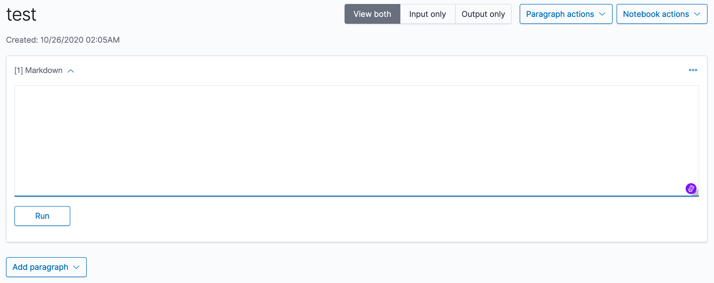
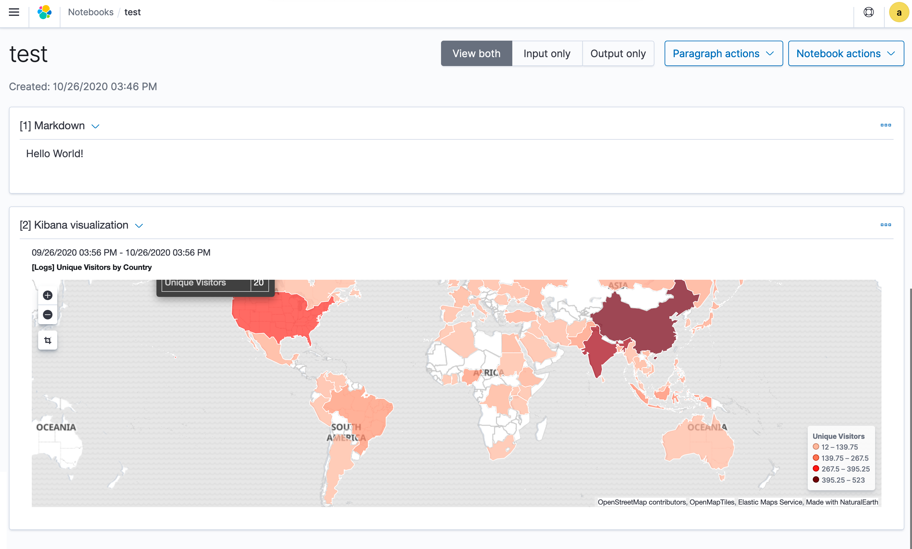

# Kibana Notebooks

A Kibana notebook is an interface that lets you easily combine live visualizations and narrative text in a single notebook interface.

With Kibana notebooks, you can interactively explore data by running different visualizations and share your work with team members to collaborate on a project.

You can add visualization paragraphs for creating graphs and markdown paragraphs for writing descriptions. You can choose multiple timelines to compare and contrast visualizations.

Common use cases include creating postmortem reports, designing runbooks, building live infrastructure reports, and writing documentation.

## Get Started with Notebooks

To get started, choose **Kibana Notebooks** in Kibana.

### Step 1: Create a notebook

A notebook is an interface for creating reports.

1. Choose **Create notebook** and enter a descriptive name.
1. Choose **Create**.

Choose **Notebook actions** to rename, duplicate, or delete a notebook.

### Step 2: Add a paragraph

Paragraphs combine text and visualizations for describing data.

#### Add a markdown paragraph

1. To add text, choose **Add markdown paragraph**.
1. Add rich text with markdown syntax.

#### Add a visualization paragraph

1. To add a visualization, choose **Add Kibana visualization paragraph**.
1. In **Title**, select your visualization and choose a date range.

- You can choose multiple timelines to compare and contrast visualizations.

To run and save a paragraph, choose **Run**.

You can perform the following actions on paragraphs:

- Add a new paragraph to the top of a report.
- Add a new paragraph to the bottom of a report.
- Run all the paragraphs at the same time.
- Clear the outputs of all paragraphs.
- Delete all the paragraphs.
- Move paragraphs up and down.
